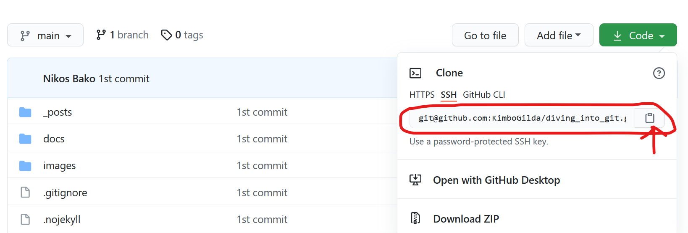
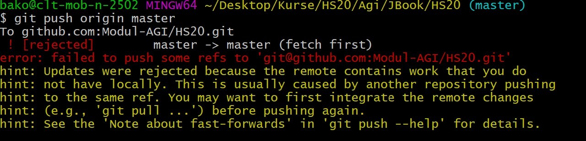

```{r setup, include=FALSE}
knitr::opts_chunk$set(echo = FALSE)

# Learn more about creating websites with Distill at:
# https://rstudio.github.io/distill/website.html

# Learn more about publishing to GitHub Pages at:
# https://rstudio.github.io/distill/publish_website.html#github-pages

```

# git basics

```{r fig.align='center', message=FALSE, warning=FALSE, out.width='70%', paged.print=FALSE}

```

## Creating a new git repository

In most case scenarios there are two ways to encounter the issue of dealing with **git**. You either want to clone a git repository or take a local directory, which is not under any version control system, and turn it into a git repository. 

### Initializing a repository on a local directory

To do so, we have to follow the following steps:

- via terminal go to your local directory location > `cd [path_to_your_project]`  
- type `git init`. The later creates a new subdirectory named __.git__ that contains all of your necessary repository files. At this point, in case there are existing files in your directory, they have to be tracked. To do so, we do the following:

- type `git add .`That way we add all the non-tracked files to the staging area _Fig_.\@ref(fig:skeleton).

```{r skeleton, fig.align='center', message=FALSE, warning=FALSE, out.width='50%',paged.print=FALSE,fig.cap= "The basic workflow of a git operation"}
knitr::include_graphics('images/git_skeleton.png')
```

### Working with an existing git repo

Quite often also arises the need of working with an existing _git repository_. In that case we have to clone the repo locally, so we can change something or even contribute to it by adding something else. To do so, we have to copy the respective repo's __url__, using the graphical user interface (gui) of a git hosting platform. In the figure below fig.\@ref(fig:url), we are showcasing how this is performed on __github__.

```{r url, fig.align='center', message=FALSE, warning=FALSE, out.width='100%',paged.print=FALSE,fig.cap= "Copying ssh url"}

```

# basic git commands

## git fetch vs git pull

- **git fetch** really only downloads new data from a remote repository - but it doesn't integrate any of this new data into your working files. Fetch is great for getting a fresh view on all the things that happened in a remote repository.
    - `git fetch origin`

- **git pull**, in contrast, is used with a different goal in mind: to update your current HEAD branch with the latest changes from the remote server. This means that pull not only downloads new data; it also directly integrates it into your current working copy files. This has a couple of consequences:
    - Since `git pull` tries to merge remote changes with your local ones, a so-called _merge conflict_ can occur.
    - Like for many other actions, it's highly recommended to start a _git pull_ only with a clean working copy. This means that you        should not have any uncommitted local changes before you pull. Use _Git's Stash_ feature to save your local changes temporarily.


## cloning a specific branch
Now let's clone a specific branch from our demo repository. There are two ways to clone a specific branch. You can either:

- Clone the repository, fetch all branches, and checkout to a specific branch immediately.
- Clone the repository and fetch only a single branch.

**Option one**

- `git clone --branch <branchname> <remote-repo-url>` _OR_

- `git clone -b <branchname> <remote-repo-url>`


**Option Two**

- `git clone --branch <branchname> --single-branch <remote-repo-url>` _OR_

- `git clone -b <branchname> --single-branch <remote-repo-url>`

## diff between a local and a remote branch

Let's assume we want to see the difference between a local branch (*bako_dev*) and remote one (*origin/bako_dev*). To do so we type the following:

- `git diff bako_dev origin_bako_dev`  

Immediately we will be transfered in a _vi environment_, where all the differences appear. To exit the _vi_environment_, we simply type **q**.


## pull before push

One quite common problem that arises in our first encounters with the beautiful world of `git` is when our commits are rejected _because the remote contains work that we do not have locally_. In this case, the first thing every user does, is to try to pull the data from the remote repository.

```{r echo=FALSE, fig.align='center', message=FALSE, warning=FALSE, out.width='100%', paged.print=FALSE}

```

Then the problem of potential conflicts arises. This can be resolved doing the following:

- Write `i` (for insert) and press ENTER
- Write your message
- Click ESC
- Write `:wq` and press ENTER


## commit history via command line

To hard reset files to HEAD on Git, we can use the `git reset` command with the `-hard` option and then specify the `HEAD`.  
Assuming that OUR branch is called **master** both locally and remotely and that your remote is called **origin** we could do the following:


````{bash, eval = FALSE}

git reset --hard HEAD # going back to HEAD

git reset --hard HEAD^ # going back to the commit before HEAD

git reset --hard HEAD~2 # going back two commits before HEAD
```

## various cases

There are cases where you have to deal with two different `SSH keys` on your accounts. In most cases you have to deal with a personal account as well as an organisational account. In these cases we have to deal with adding the one of the two keys into the active `SSH agent`.

### adding an SSH key

First of all we have to ensure that the **ssh-agent** is running. To do so, we do the following:

````{bash, eval = FALSE}
eval $(ssh-agent  -s)

# add your private key to the ssh-agent
# as an example we assume that our key is called "mykey"

ssh-add ~/.ssh/mykey
```


